# numerical-analysis

code relative to bachelor course in University of Milano-Bicocca about numerical analysis

The purpose of the courseis modelling a bar suspended from the ceiling.

At first we use a discrete model, composed by a succession of masses and springs. The code relative to this part is contained in `./discrete`.

Secondly we use a continuous model. We start with using matlab symbolic computations to find the parameters of the parabolas that solve a simple case. Then we use a simple 1d finite elements method to address the general Sturm-Liouville problem.

We conclude by solving the 1d heat equation. We use the 1d fem to tackle the space dervatives and transform the PDE into a system of ODEs. Then we use implict Euler to approximate the system of ODE and get the time evolution.

## Discrete model

We model a system composed by a succession of point-like masses and ideal springs suspended from the ceiling. The last mass can be free or connected to the ground with a spring.
There are two different programs:

* equilibrium.m

 The first solves the equilibrium problem.

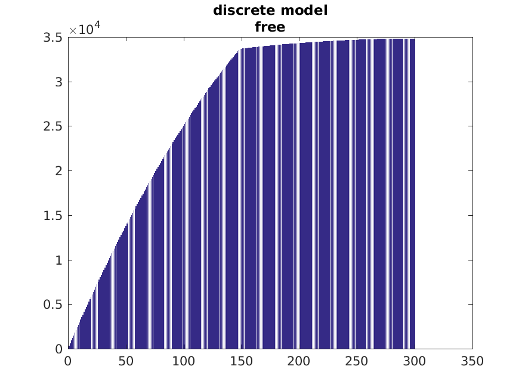

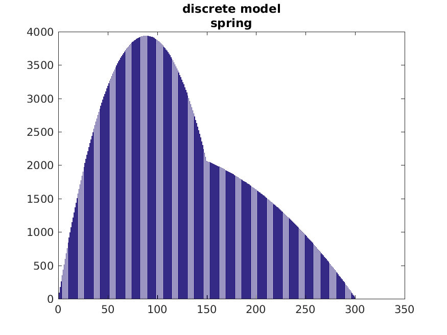


* oscillations.m

 The second consider the non-equilibrium problem, in which the masses oscillates around their equilibrium positions.

## Continuous model

### Bar suspended from the ceiling

We start from modelling a continuos 1d bar suspended from the ceiling, resulting in
```.latex
-(c*u')' = f
BC
```

Then we develop 1d finite elements methosd for the general Sturm-Liouville problem:
```.latex
-(c*u')' ++ b*u' +a*u = f
BC
```

#### Exact

We solve analytically
```.latex
-(c*u')' = f
BC
```

in the case with constant `c` anf `f` parameters, using MATLAB symbolic toolkit.

Files

* continuous/exact/exact_constant.m

#### FEM equilibrium

We develop the 1d finite elements method to solve the general Sturm-Liouville problem
// CHECK IF THIS IS REALLY CALLED LIKE SO

```.latex
-(c*u')' + b*u' +a*u = f
BC
```

##### Main program

The main program is inside `sturm-liouville/fem-eq-DN-DD`, and implements the 1d fem with Dirichlet-Neumann or Dirichlet-Dirichlet BC.
We left in this folder the tools to test the method against a problem whose solution in known, in order to spot bugs.

##### Check

The real testing of the method is done in `sturm-liouville/fem-eq-DN-DD-check`, in which given the parameters and an exact solution, athe constant term is computed and then used to run the fem. This program also checks that the parameters satisfy the condition `-b_x(x)/2+a(x)>0 \quad \forall x \in [0,1]`, if they do not then the fem is not guaranteed to work.

```.text
c     : 10*xs
b     : -xs^2
a     : xs + 3
fe    : 2000*xs*exp(-100*xs^2) - 100*cos(10*xs) + (sin(10*xs) + exp(-100*xs^2))*(xs + 3) - xs^2*(10*cos(10*xs) - 200*xs*exp(-100*xs^2)) + 10*xs*(100*sin(10*xs) + 200*exp(-100*xs^2) - 40000*xs^2*exp(-100*xs^2))
f     : @(xs)cos(xs.*1.0e1).*-1.0e2+xs.*exp(xs.^2.*-1.0e2).*2.0e3+(sin(xs.*1.0e1)+exp(xs.^2.*-1.0e2)).*(xs+3.0)-xs.^2.*(cos(xs.*1.0e1).*1.0e1-xs.*exp(xs.^2.*-1.0e2).*2.0e2)+xs.*(sin(xs.*1.0e1).*1.0e2+exp(xs.^2.*-1.0e2).*2.0e2-xs.^2.*exp(xs.^2.*-1.0e2).*4.0e4).*1.0e1
ue    : sin(10*xs) + exp(-100*xs^2)
alpha : 1
beta  : exp(-100) + sin(10)
gamma : 100*cos(10) - 2000*exp(-100)
```

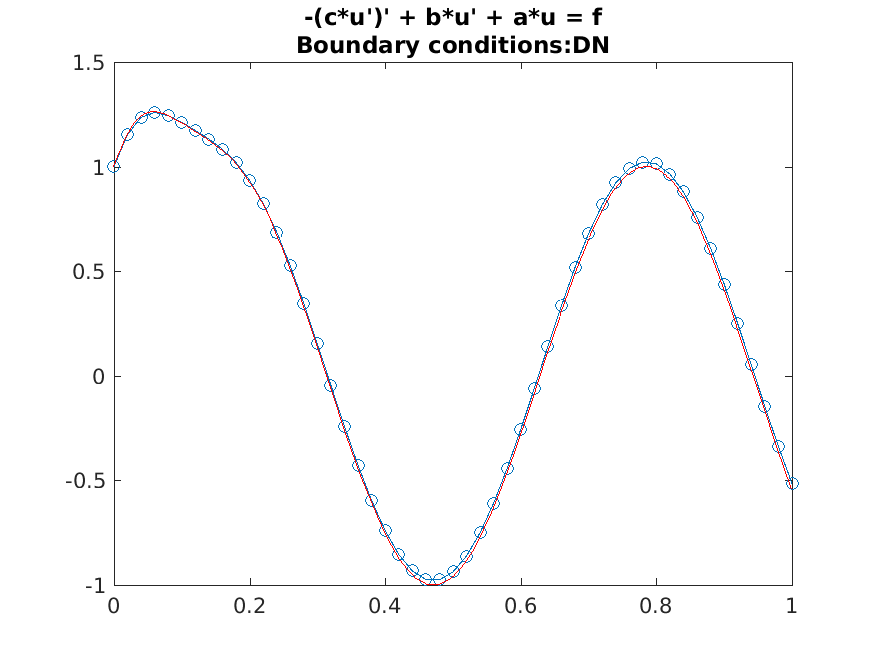

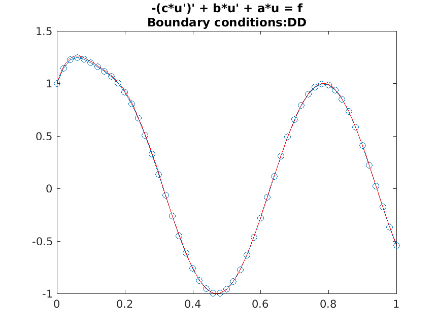

##### Error Analysis

Then `sturm-liouville/fem-eq-DN-DD-error-analysis` performs an error analysis of the fem against a problem whose solution is known, plotting the error in the max norm ( `max(u-uh) \ for \ x \in [0,1]` ) versus the max of the lattice steps.

```.text
c     : 10*xs
b     : -xs^2
a     : xs + 3
fe    : 2000*xs*exp(-100*xs^2) - 100*cos(10*xs) + (sin(10*xs) + exp(-100*xs^2))*(xs + 3) - xs^2*(10*cos(10*xs) - 200*xs*exp(-100*xs^2)) + 10*xs*(100*sin(10*xs) + 200*exp(-100*xs^2) - 40000*xs^2*exp(-100*xs^2))
f     : @(xs)cos(xs.*1.0e1).*-1.0e2+xs.*exp(xs.^2.*-1.0e2).*2.0e3+(sin(xs.*1.0e1)+exp(xs.^2.*-1.0e2)).*(xs+3.0)-xs.^2.*(cos(xs.*1.0e1).*1.0e1-xs.*exp(xs.^2.*-1.0e2).*2.0e2)+xs.*(sin(xs.*1.0e1).*1.0e2+exp(xs.^2.*-1.0e2).*2.0e2-xs.^2.*exp(xs.^2.*-1.0e2).*4.0e4).*1.0e1
ue    : sin(10*xs) + exp(-100*xs^2)
alpha : 1
beta  : exp(-100) + sin(10)
gamma : 100*cos(10) - 2000*exp(-100)
```

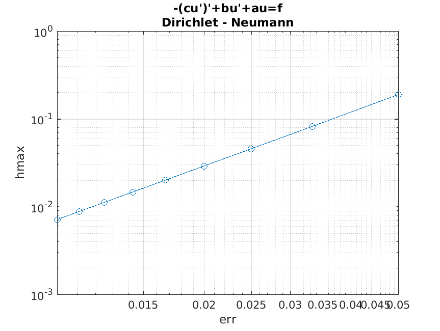

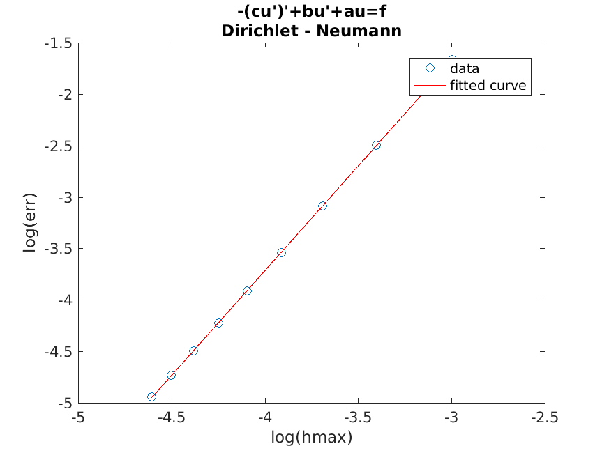

where from the fit we get that the error in the max norm is proportional to the squared max lattice step
```.text
Linear model Poly1:
f(x) = p1*x + p2
Coefficients (with 95% confidence bounds):
  p1 =       2.035  (2.03, 2.04)
  p2 =       4.422  (4.401, 4.442)
```

### Heat equation

We approximate the solution of the 1d heat equation

```.latex
\rho(x)*u_t(t,x) - (c(x)*u(t,x)_x)_x = f(x)
BC in x=0
BC in x=1
IC in t=0
```

We start with treating as a parameter and applying the fem for all t `\in [0, \infty]` and we are left with a system of ordinary linear differential equations.

We then use the implicit Euler method to solve the system of ODEs.

We consider three BC combinations:

* Dirichlet-Neumann
* Dirichlet-Dirichlet
* Neumann-Neumann

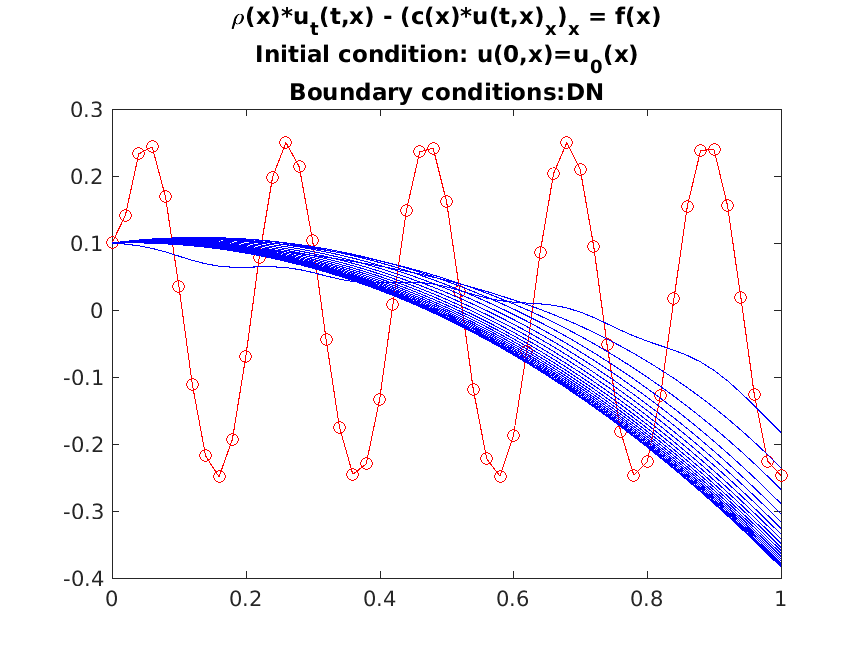

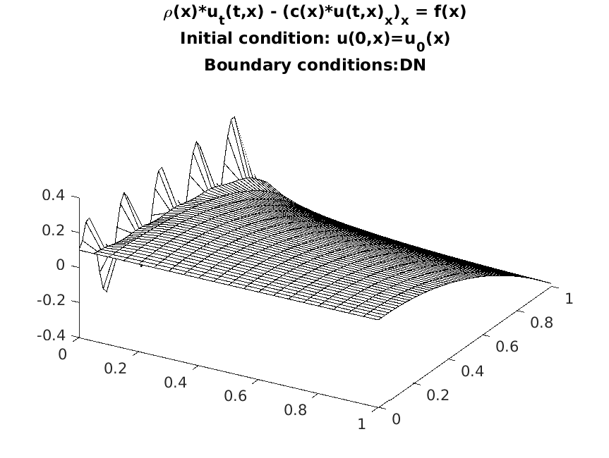

The last case is particularly interesting since it models the case in which the flux of energy is fixed at both points of the border. If the flux is set to be zero and the constant term `f` is greater then 0, then it means that energy is constantly pumped into the system, but it can not flow out throught the boundaries, and hence the temperature grows indefenitly.

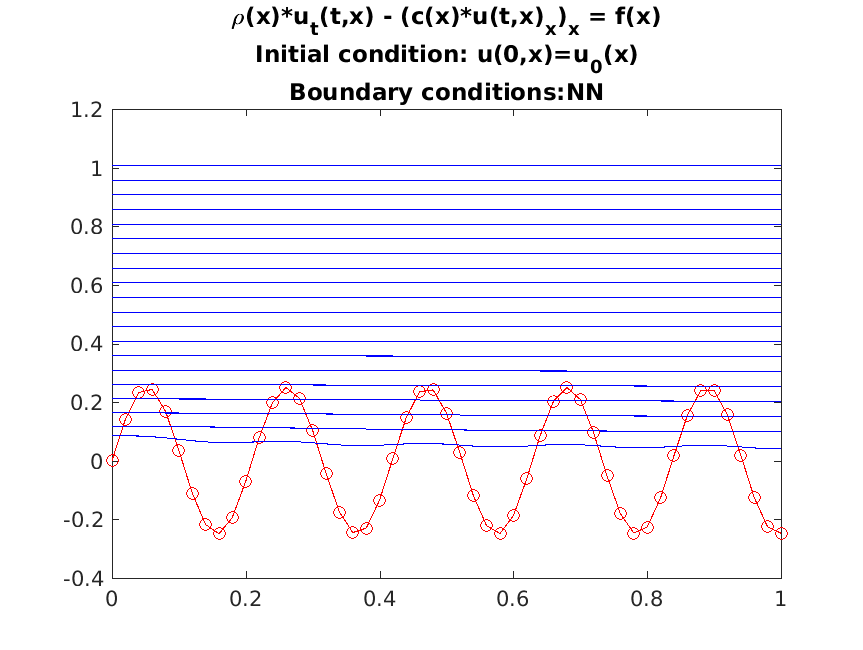


Similarly, if the flow of energy out of the boundaries is too high compared to the constant term, the temperature decreases indefenitely.

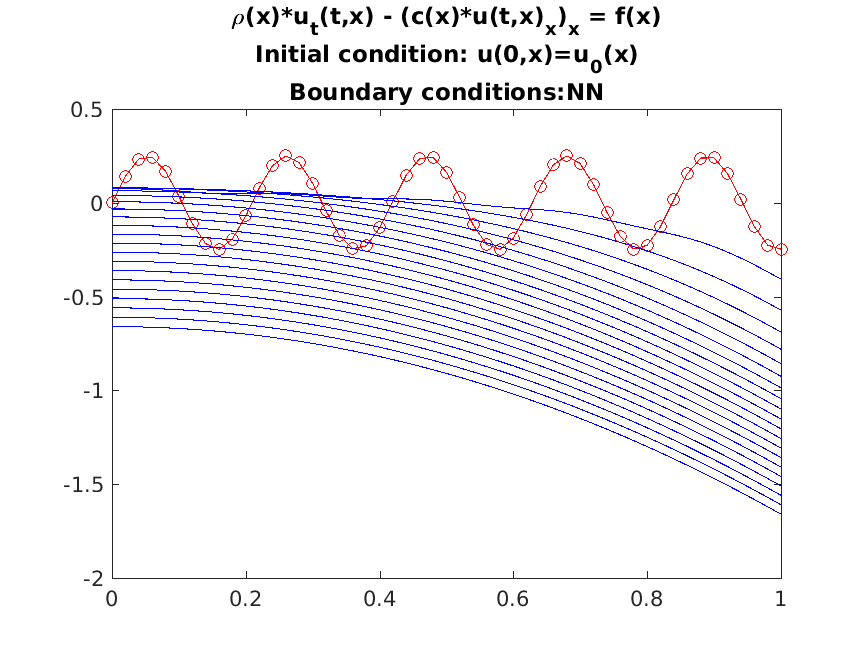


It is also possible to find a combination of BC and parameters such that the temperature converges to a stable equilibrium solution.

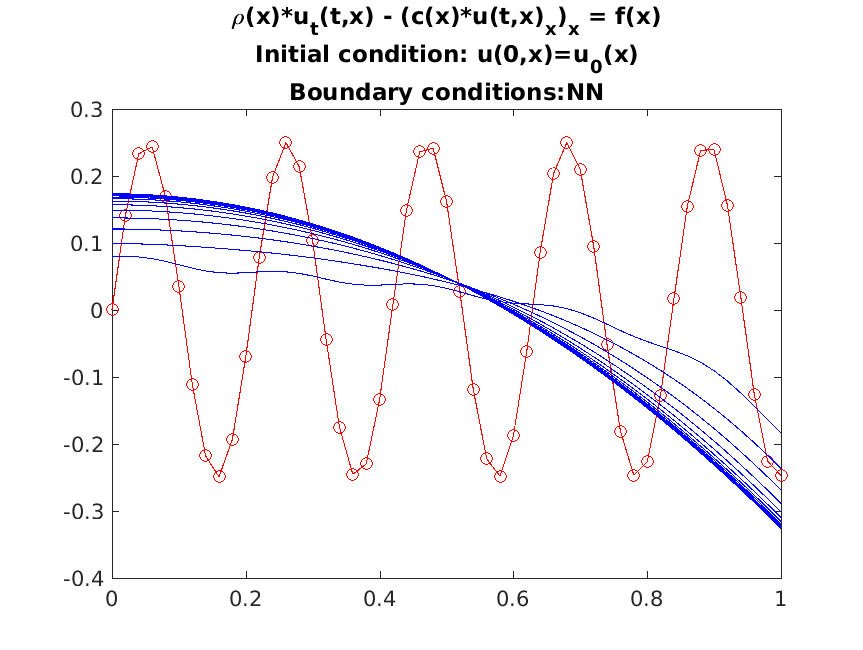

This behaviour is justified since the relative equilibrium problem, which has Neumann-Neumann BCs, is not guaranteed to have a unique solution.
